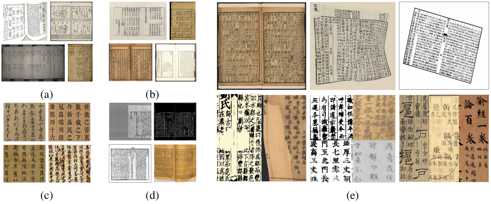
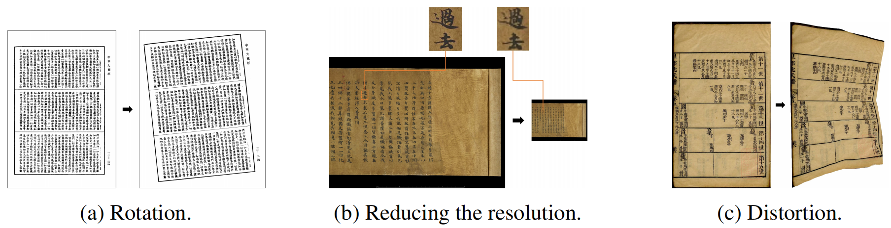
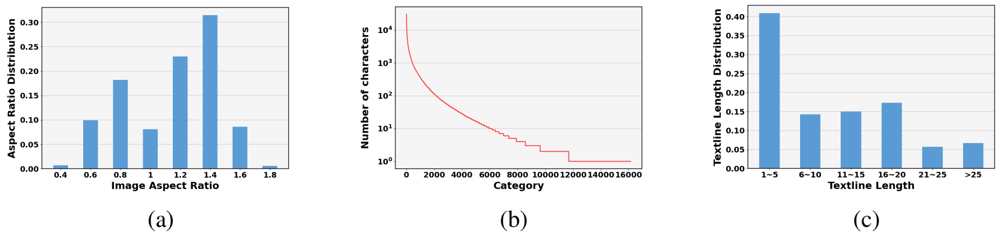

# Download

- The M<sup>5</sup>HisDoc dataset can only be used for non-commercial research purposes. For scholar or organization who wants to use the M<sup>5</sup>HisDoc dataset, please first fill in this [Application Form](./Application_form/Application-Form-for-Using-M5HisDoc.docx) and sign the [Legal Commitment](./Application_form/Legal-Commitment-for-Using-M5HisDoc.docx) and email them to us. When submitting the application form to us, please list or attached 1-2 of your publications in the recent 6 years to indicate that you (or your team) do research in the related research fields of handwriting verification, handwriting analysis and recognition, document image processing, and so on. 
- We will give you the download link and the decompression password after your application has been received and approved.
- All users must follow all use conditions; otherwise, the authorization will be revoked.

# License
The M<sup>5</sup>HisDoc dataset should be used and distributed under the [Creative Attribution-NonCommercial-NoDerivatives 4.0 International (CC BY-NC-ND 4.0) License](https://creativecommons.org/licenses/by-nc-nd/4.0/) for non-commercial research purposes.

# M<sup>5</sup>HisDoc Dataset
The M<sup>5</sup>HisDoc dataset comprises a collection of 8,000 images, 403,824 text lines with 4,367,392 characters in 16,151 categories. 


<p align="center">Figure 1. An overview of the proposed M5HisDoc dataset. For better visibility, please zoom in on
the image. (a) Multiple layouts. (b) Multiple document types. (c) Multiple calligraphy styles. (d)
Multiple backgrounds. (e) Multiple challenges, including dense texts, distortion, rotation, damage,
image blurriness, and variations in font sizes.</p>


As shown in Figrure 1, M<sup>5</sup> indicates five properties of style, ie., Multiple layouts, Multiple document types, Multiple calligraphy styles, Multiple backgrounds and Multiple challenges. The M<sup>5</sup>HisDoc dataset consists of two subsets, M<sup>5</sup>HisDoc-R (Regular) and M<sup>5</sup>HisDoc-H (Hard). The M<sup>5</sup>HisDoc-R subset comprises 4,000 historical document images. To ensure high-quality annotations, we meticulously perform manual annotation and triple-checking. 


<p align="center">Figure 2.  Example of data processing to generate M5HisDoc-H subset.</p>

As shown in Figrure 2, to replicate real-world conditions for historical document analysis applications, we incorporate image rotation, distortion, and resolution reduction into M<sup>5</sup>HisDoc-R subset to form an new challenging subset named M<sup>5</sup>HisDoc-H, which contains the same number of images as M<sup>5</sup>HisDoc-R.


Both the annotations in character-level and text-line-level are provided, including text bounding box, text content, and the corresponding reading order. Therefore, M<sup>5</sup>HisDoc can be applied on a wide range of tasks, including text-line/charater detection, recognition and reading order prediction.


# Collection
Our data collection process consists of three main sources. Firstly, we carefully select 300 images from the train set of MTHv2 and 700 images from SCUT-CAB, which serve as representative samples. Secondly, we gather tens of thousands of scanned images from electronic ancient books available on the Internet, encompassing 131 ancient books. From this collection, we manually curate 2,799 historical document images taken from 37 representative books. Thirdly, we conduct realistic photo shoots to simulate photographing situation. By selecting four physical Chinese ancient books, we capture 201 images using a scanner, considering various angles and lighting conditions. In total, we obtain 4,000 images to establish the M5HisDoc benchmark.


# Statistics

<p align="center">Figure 3.   Statistics of M5HisDoc. (a) The aspect ratio of the images. (b) The number of characters
per category. (c) The distributions of the text line length.</p>
We also calculate the aspect ratio of the images, the number of characters per category, and the distributions of the text line length. As shown in Fig. 3a, the aspect ratio of the images varies significantly, ranging from less than 0.4 to more than 1.8. This is because M<sup>5</sup>HisDoc contains a variety of styles and layouts. The number of samples per category exhibit a clear long-tail distribution, as demonstrated in Fig. 3b. The category with the largest number of samples consists of over 30,000 instances, whereas the category with the fewest has fewer than 3 samples. It can also be observed from Fig. 3c that there exists a notable diversity in text length in M<sup>5</sup>HisDoc. About 40% of texts exhibit a length of fewer than 6 characters, while about 7% of texts surpass the threshold of 25 characters. Some texts are extremely long, with the longest text containing 58 characters.


# Directory Format
The dataset is organized in the following directory format:
```
├── M5HisDoc
    ├── M5HisDoc_regular
        ├── images
        │   ├── xxx.jpg
        │   └── ...
        ├── label_textline
        │   ├── xxx.txt
        │   └── ...
        ├── label_char
        │   ├── xxx.txt
        │   └── ...
    ├── M5HisDoc_hard
        ├── images
        │   ├── xxx.jpg
        │   └── ...
        ├── label_textline
        │   ├── xxx.txt
        │   └── ...
        ├── label_char
        │   ├── xxx.txt
        │   └── ...
    ├── split_train.txt
    ├── split_val.txt
    ├── split_test.txt
    ├── char_dict.txt


```

# Citation
```
@inproceedings{shi2023m5hisdoc,
  title={M5HisDoc: A Large-scale Multi-style Chinese Historical Document Analysis Benchmark},
  author={Shi, Yongxin and Liu, Chongyu and Peng, Dezhi and Jian, Cheng and Huang, Jiarong and Jin, Lianwen},
  booktitle={Thirty-seventh Conference on Neural Information Processing Systems Datasets and Benchmarks Track},
  year={2023}
}
```

# Contact
For any questions about the dataset, please contact the authors by sending an email to Prof. Jin([eelwjin@scut.edu.cn](mailto:eelwjin@scut.edu.cn), or [lianwen.jin@gmail.com](mailto:lianwen.jin@gmail.com)). 
